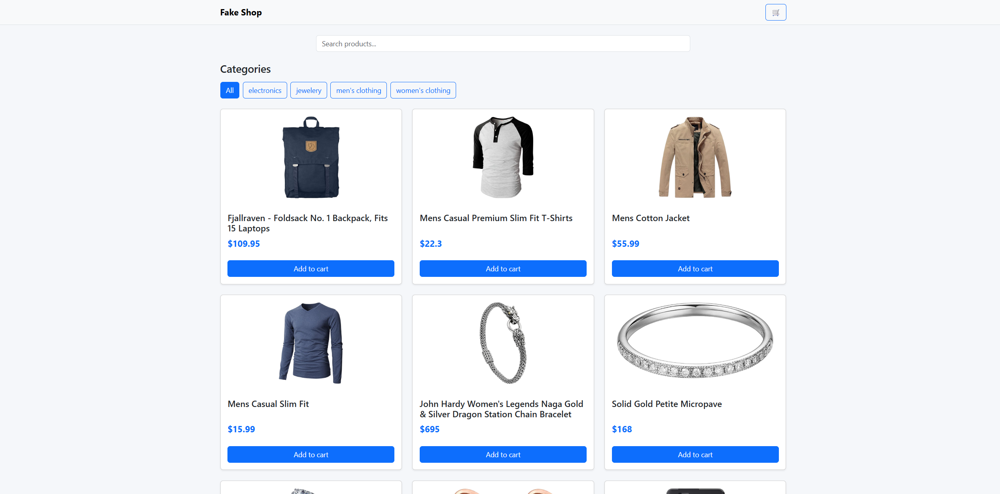

# Fake Shop

A simple e-commerce application built with **Vanilla JavaScript**, HTML, CSS and Bootstrap.

## Screenshot



## Features

* Product catalog
* Product details modal
* Product search
* Product category filtering
* Shopping cart
* Add and remove products
* Update product quantities
* Clear shopping cart
* Checkout flow
* Local Storage persistence
* Toast notifications
* Loading skeleton
* Responsive design

## Project Structure

```text
src/
├── config/
├── controllers/
├── models/
├── repositories/
├── services/
├── state/
├── ui/
├── utils/
└── main.js
```

### Architecture

The application follows a modular architecture:

* **Controllers**: Handle user interactions and application flow.
* **Services**: Retrieve data from external APIs.
* **Repositories**: Manage browser persistence using Local Storage.
* **UI**: Render the user interface.
* **State**: Store the global application state.
* **Config**: Centralize application configuration.

## Technologies

* HTML5
* CSS3
* Vanilla JavaScript (ES Modules)
* Bootstrap 5
* Bootstrap Icons
* Fake Store API

## Getting Started

Clone the repository:

```bash
git clone <repository-url>
```

Open the project in **Visual Studio Code** and run it using the **Live Server** extension.

## API

The application consumes data from:

https://fakestoreapi.com/

## Author

**Franco Julián Barrera**
